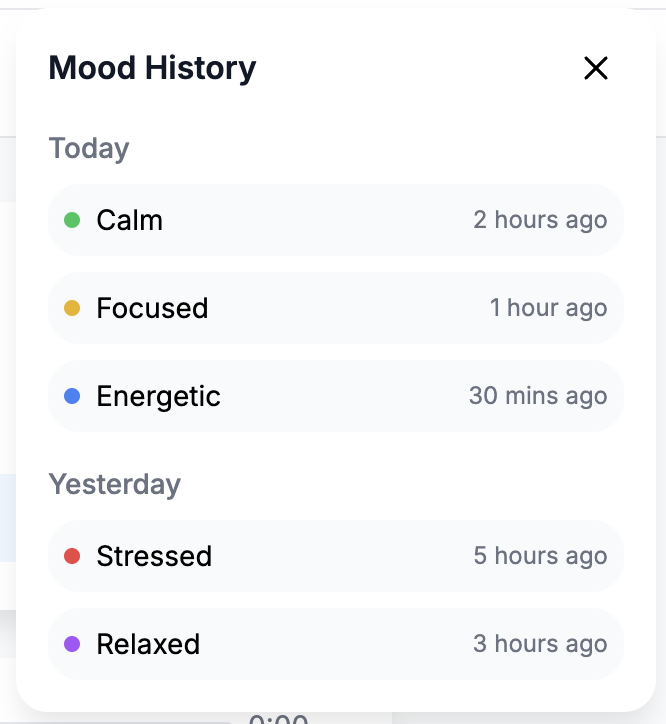

# CrescendoAI

  

## 🎵 Intelligent Music Experience

CrescendoAI is an innovative music platform that combines behavioral analysis, mood tracking, and intelligent recommendations to create a personalized listening experience. Our system adapts to your emotional state and preferences in real-time, ensuring the perfect soundtrack for every moment.

## ✨ Key Features

### 🎯 Real-time Mood Detection
Our advanced behavioral pipeline, powered by Google's Gemini API, analyzes your interactions and physiological metrics to detect your current mood state with unprecedented accuracy. The system then intelligently adjusts music recommendations to match your emotional needs.

### 🎨 Intuitive User Interface
Experience a seamless and beautiful interface designed for effortless music discovery and mood tracking.

### 📊 Comprehensive Mood Analytics
Track your emotional journey with detailed mood history and insights. Our system provides valuable analytics to help you understand your emotional patterns.

### 📈 Mood Distribution & Insights
Get a clear overview of your mood patterns with our comprehensive mood distribution analysis.

### 🎼 Smart Queue Management
Our intelligent queue system adapts to your preferences and current mood, ensuring a continuous flow of perfectly matched music.

### 🧘‍♂️ Integrated Wellness Features
When stress levels are detected, our system automatically suggests breathing exercises to help you relax and maintain emotional balance.

### 🎛️ Personalized Preferences
Customize your experience with:
- Energy level ceilings
- Genre weight adjustments
- New music exploration settings

## 🔄 Real-time Features

### 🎭 Mood Updates
- AI-powered mood detection using Gemini API
- Advanced behavioral pattern recognition
- Manual mood overrides
- Real-time mood state streaming via SSE
- Mood change notifications

### 🎵 Queue Management
- Dynamic queue adjustments
- Real-time queue updates
- Intelligent reordering based on mood
- Seamless track transitions

### 📝 Feedback System
- Instant feedback processing
- Real-time acknowledgment
- Adaptive learning from feedback

## 🛠️ Technical Architecture

### 🧠 Behavioral Pipeline
- Real-time metric processing
- Gemini API integration for mood inference
- Redis-based state management
- Event-driven architecture

### 💾 Data Management
- SQLAlchemy for persistent storage
- Redis for real-time state
- Efficient caching strategies
- Robust error handling

### 🔌 API Integration
- RESTful endpoints
- WebSocket support
- Server-Sent Events
- Comprehensive error handling
- Gemini API for advanced mood analysis

## 🎯 Use Cases

### 🎧 Personal Listening
- Mood-based music discovery
- Stress management through music
- Personalized playlists
- Emotional journey tracking

### 🏢 Professional Settings
- Focus-enhancing background music
- Stress reduction in workplace
- Team mood analytics
- Productivity optimization

## 📱 Platform Support

- Web-based interface
- Responsive design
- Cross-browser compatibility
- Mobile-friendly experience

## 🔮 Future Roadmap

- Enhanced mood detection algorithms with Gemini API
- Social features integration
- Advanced analytics dashboard
- AI-powered playlist generation
- Integration with wellness apps

---

  

*Experience the future of intelligent music listening with CrescendoAI* 
